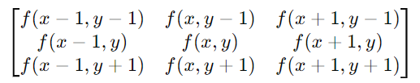
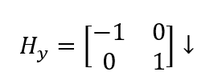

# Edge Detection.
## 1. Phát hiện biên dùng Gradient.
- Gradient là một vecto có các thành phần biểu thị tốc độ thay đổi mức xám của điểm ảnh (theo hai hướng x, y đối với ảnh 2 chiều), tức là:

- Ta có:

Trong đó: dx, dy là khoảng cách giữa 2 điểm kế cận theo hướng x, y tương ứng. (Thực tế chọn dx=dy=1)
- Nếu tính toán Gradient trên ảnh, việc xử lý sẽ rất phức tạp nên để đơn giản, thường tính Gradient thông qua dùng cặp mặt nạ trực giao H1, H2.
- Nếu định nghĩa Gx, Gy tương ứng là Gradient theo hai hướng x, y thì vector Gradient của một ảnh f(x,y) là:

- Để giảm mức độ tính toán, f(x,y) được tính gần đúng như sau:

### 1.1. Kỹ thuật Sobel. 
- Phép toán Sobel thực chất là phép tích chập (convolution) giữa ảnh và một kernel Sobel, chứ không phải đơn thuần là tính đạo hàm theo công thức toán học truyền thống. Tuy nhiên, kernel Sobel được thiết kế để xấp xỉ phép tính gradient của ảnh theo hướng x và y.
#### __1.1.1. Cách hoạt động của Sobel.__
Phép Sobel áp dụng kernel (hạt nhân) cho từng pixel trong ảnh, tương tự như phép convolution trong xử lý ảnh. Mỗi kernel là một ma trận nhỏ (thường 3x3) có các trọng số giúp tính toán sự thay đổi cường độ (gradient) trong ảnh.
- __Các kernel Sobel:__
    - Kernel Sobel theo hướng x (dx=1, dy=0)
    
    - Kernel Sobel theo hướng y (dx=0, dy=1)
    

- __Ví dụ tính Sobel theo hướng x:__  
    - Với kernel Sobel theo trục x, ta có:
 
    - Nếu ta áp dụng kernel này lên một vùng nhỏ 3x3 của ảnh:
 
    - Thì kết quả thu được là:
 

#### __1.1.2. np.uint8(cv2.Sobel()).__
Đó cũng là câu trả lời cho việc tại sao các giá trị của gradient trả về có thể âm hoặc lớn hơn 255, dù cho về mặt ý tưởng gradient (đạo hàm) là lấy giá trị sau trừ giá trị trước và các giá trị đều nằm trong đoạn [0, 255].
- __cv2.Sobel(self.image, cv2.CV_64F, dx=1, dy=0, ksize=1):__
    - __self.image__: Đây là ảnh gốc mà bạn muốn tính toán đạo hàm (ảnh này có thể là ảnh xám hoặc ảnh màu).
    - __cv2.CV_64F__: Kiểu dữ liệu của kết quả sau phép tính Sobel. Ở đây, kết quả được lưu trữ dưới dạng 64F, tức là số thực 64-bit (float64), để đảm bảo tính toán gradient chính xác.
    - __dx=1__: Đạo hàm bậc nhất theo trục x (tính gradient theo hướng ngang).
    - __dy=0__: Không tính đạo hàm theo trục y (không tính gradient theo hướng dọc).
    - __ksize=1__: Kích thước kernel là 1, tức là sử dụng phép tính Sobel với kích thước kernel nhỏ nhất có thể (tương tự với phép toán đạo hàm trung tâm cơ bản).

#### __1.1.3. Vì sao cần CV_64F:__
- Kiểu CV_64F được dùng để giữ độ chính xác khi tính gradient, vì các giá trị âm hoặc giá trị lớn hơn 255 không thể được lưu trữ trong kiểu dữ liệu uint8 (giá trị của uint8 chỉ từ 0 đến 255).
- Sau khi tính gradient, bạn chuyển về uint8 bằng cách sử dụng np.uint8(). Quá trình này thường bao gồm việc lấy giá trị tuyệt đối (để loại bỏ số âm) và chuẩn hóa các giá trị để chúng nằm trong khoảng từ 0 đến 255. Tuy nhiên, điều này có thể làm mất một phần thông tin về cường độ gradient.

Tóm lại, gradient có thể lớn hơn 255 hoặc âm vì quá trình tính toán liên quan đến phép trừ và sử dụng các giá trị pixel khác nhau, dẫn đến kết quả vượt ngoài phạm vi của một pixel thông thường (0-255).

### 1.2. Kỹ thuật Prewitt.
Tương tự với ý tưởng của kỹ thuật Sobel. Ta cũng sẽ có kernel Prewitt ứng với mỗi hướng x, y. 
- __Các kernel Prewitt:__
    - Kernel Prewitt theo hướng x (dx=1, dy=0)
    
    - Kernel Prewit theo hướng y (dx=0, dy=1)
    

- __Và 2 kernel phát hiện biên theo đường chéo:__
    - Kernel Prewit chéo (45 độ):
    
    - Kernel Prewit chéo (135 độ):
    

### __1.3. Sự khác biệt giữa Sobel và Prewit:__
#### __1.3.1__. Ý nghĩa:
__1. Trọng số lớn hơn ở hàng giữa trong Sobel:__
- Trong kernel Sobel, hàng giữa có trọng số lớn hơn (±2) so với các hàng trên và dưới (±1). Điều này làm cho Sobel nhạy hơn với sự thay đổi theo phương ngang (trục x), đặc biệt là ở các điểm gần trục giữa của kernel.
- Việc đặt trọng số lớn hơn ở hàng giữa giúp kernel Sobel ưu tiên sự thay đổi ở gần các điểm ảnh trung tâm hơn so với các điểm ở viền. 

__2. Prewitt ít nhạy cảm hơn với nhiễu:__
- Kernel Prewitt có trọng số đồng đều (±1) ở cả ba hàng. Điều này làm cho Prewitt trở thành một bộ lọc đơn giản hơn, ít nhạy hơn với nhiễu và những thay đổi nhỏ so với Sobel.
- Prewitt chủ yếu đo sự thay đổi cường độ theo phương ngang mà không ưu tiên phần trung tâm như Sobel, do đó nó có thể phù hợp với những tình huống không cần nhấn mạnh các cạnh mạnh.

#### __1.3.2__ Ảnh hưởng tới kết quả:

- Sobel: Thường nhạy cảm hơn với các cạnh và tạo ra kết quả rõ ràng hơn do sự thay đổi trọng số giữa các hàng. Nó thường được sử dụng trong những trường hợp cần phát hiện cạnh một cách chi tiết hơn.

- Prewitt: Đơn giản hơn, ít nhạy hơn với nhiễu. Thường được sử dụng trong các trường hợp cần tính toán nhanh và không yêu cầu độ chính xác cao như Sobel.

__Tóm lại:__
Sự khác biệt giữa Sobel và Prewitt chủ yếu nằm ở việc Sobel có trọng số lớn hơn ở hàng giữa, giúp nó nhạy cảm hơn với sự thay đổi gần trung tâm của kernel. Prewitt có cấu trúc đồng đều hơn, đơn giản và ít nhạy cảm với nhiễu.

### __1.4. Kỹ thuật Robert.__

Ưu điểm: chỉ sử dụng 4 pixel, tính toán nhanh. 
Nhược điểm: mặt nạ nhỏ, nhạy với nhiễu.

- Kernel Robert theo hướng ngang (x):

- Kernel Robert theo hướng dọc (y):
 

### __1.5. Kỹ thuật La bàn.__
Kỹ thuật sử dũng 8 kernel nhân chập 8 hướng lần lượt là 0, 45, 90, 135, 180, 225, 270, 315. 
 

## 2. Phát hiện biên dùng Laplace.
- Các phương pháp đánh giá gradient ở trên làm 
việc khá tốt khi ảnh có cường độ sáng thay đổi rõ rệt.
- Nhược điểm: nhạy cảm với nhiễu và tạo các biên kép làm chất lượng biên thu được không cao.
- Khi mức xám thay đổi chậm, miền chuyển tiếp trải rộng, phương pháp hiệu quả hơn là sử dụng đạo hàm bậc hai Laplace.
- Toán tử Laplace được xây dựng trên cơ sở đạo 
hàm bậc 2 của hàm biến đổi mức xám.
 
Trong đó:
 
Tương tự ta có:
 
Do đó, ta thu được:
 
- 3 kiểu mặt nạ thường dùng:
 

### 2.1. Thuật toán Canny.

## 3. Phát hiện đường thẳng.
### 3.1. Hough Transform.
- "linesP = cv2.HoughLines(img_input, rho, theta, threshold, line, )  
Trong đó:
    - img_input: ảnh đầu vào.
    - rho: 
    - theta: bước nhảy góc trong không gian Hough.
    - threshold: ngưỡng (số đường thẳng tối đa đi qua 1 điểm)
### 3.1.1. cv2.HoughLinesP()
- Lưu ý là HoughLines có P, nên hàm sẽ trả về đoạn thẳng chứ không phải đường thẳng vô hạn như cv2.HoughLines().
- Do đó, linesP[i][0] là duyệt từng cặp đoạn thứ i. Ứng với nó sẽ lấy cặp (x_i_1, y_i_1).

## Tài liệu tham khảo.
[[1]. Viet Anh on Software - "Phát hiện đường thẳng với Hough Transform - OpenCV"](https://www.vietanh.dev/blog/2019-10-24-hough-transform-phat-hien-duong-thang)

[[2]. VINBIGDATA - "Canny - Phát hiện cạnh trong OpenCV: Hướng dẫn chi tiết từng bước](https://vinbigdata.com/kham-pha/canny-phat-hien-canh-trong-opencv-huong-dan-chi-tiet-tung-buoc.html)
